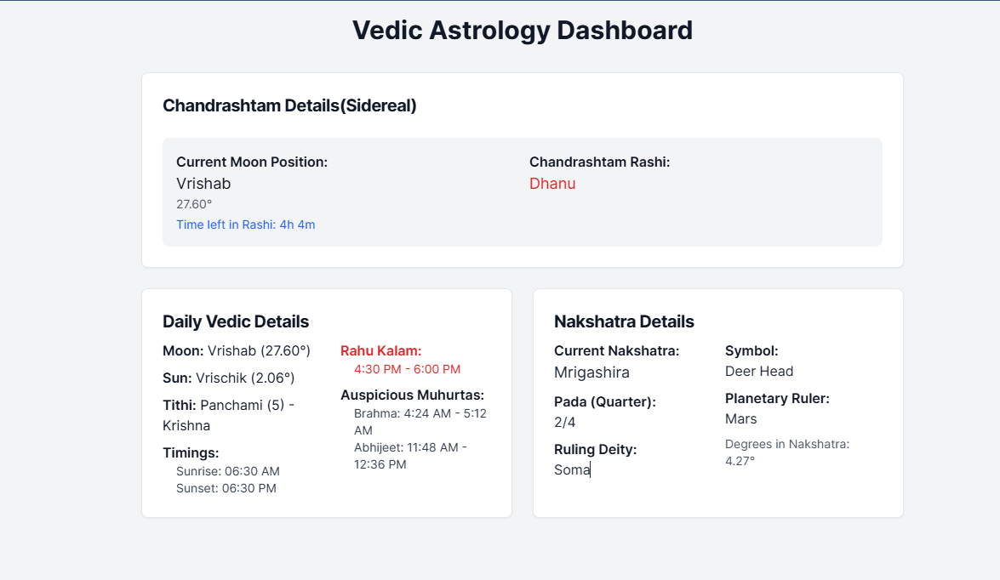

# Vedic Astrology Dashboard

A modern web application that provides real-time Vedic astronomical calculations including Chandrashtam, Nakshatra positions, and Panchang details. This is my first project, focused on making Vedic astronomical calculations accessible through a modern interface.



## 🌟 Features

- **Chandrashtam Calculator**
  - Real-time Moon position in sidereal zodiac
  - Chandrashtam (8th from Moon) calculation
  - Accurate astronomical calculations using Astronomia library
  - Ayanamsa corrections (Lahiri)

- **Nakshatra Details**
  - Current Nakshatra with Pada (quarter)
  - Ruling deity and planetary ruler
  - Traditional symbols
  - Precise degree calculations

- **Panchang Details**
  - Inauspicious periods - Rahu Kalam
  - Tithi and Paksha (Date and Phase of Moon)
  - Customizable location-based calculations
  

## 💻 Technology Stack

- React (Vite) - Frontend framework
- TailwindCSS - Styling
- Shadcn/ui - UI Components
- Astronomia - Astronomical calculations
- Vercel - Deployment

## ⚙️ Prerequisites

```bash
Node.js >= 16.0.0
npm >= 7.0.0
```
## Installation

1. Clone the repository:
```bash
git clone https://github.com/hokage-mihir/vedic-astrology-dashboard
cd vedic-astrology-dashboard
```

2. Install dependencies:
```bash
npm install
```

3. Start the development server:
```bash
npm run dev
```

## 📁 Project Structure

```
vedic-astrology-dashboard/
├── src/
│   ├── components/
│   │   ├── ChandrashtamCalculator.jsx
│   │   ├── NakshatraInfo.jsx
│   │   ├── VedicDetails.jsx
│   │   ├── PanchangDetails.jsx
│   │   └── ui/
│   │       ├── card.jsx
│   │       └── alert.jsx
│   ├── lib/
│   │   └── astro-calculator.js
│   ├── App.jsx
│   └── main.jsx
├── public/
├── index.html
├── tailwind.config.cjs
├── postcss.config.cjs
└── vite.config.js
```

## 🔧 Component Details

### ChandrashtamCalculator
Calculates and displays the current Moon position and the Chandrashtam (8th house) position in real-time.
- The afflicted Rashi
- Duration in current Rashi

### NakshatraInfo
Shows detailed information about the current lunar mansion including:
- Nakshatra name and pada
- Ruling deity
- Traditional symbol
- Planetary ruler

### PanchangDetails
Provides comprehensive daily timing information:
- Current Tithi
- Rahu Kaal - Inauspicious Period
- Sun and Moon positions with degrees
- Daily auspicious periods

## ⚡ Customization

### Ayanamsa Settings
You can modify the ayanamsa calculation in `astro-calculator.js`:
```javascript
const calculateAyanamsa = (jd) => {
  const T = (jd - 2451545.0) / 36525;
  return 23.85 + 0.0137 * T;
};
```

### Time Periods
Customize the Muhurta and other time period calculations in `PanchangDetails.jsx`.

## 🤝 Contributing

1. Fork the repository
2. Create your feature branch (`git checkout -b feature/AmazingFeature`)
3. Commit your changes (`git commit -m 'Add some AmazingFeature'`)
4. Push to the branch (`git push origin feature/AmazingFeature`)
5. Open a Pull Request

## 📝 License

This project is licensed under the MIT License - see the LICENSE.md file for details

## 🙏 Acknowledgments

- [Astronomia](https://github.com/commenthol/astronomia) for astronomical calculations
- [Shadcn/ui](https://ui.shadcn.com/) for React components
- Indian astrological texts for traditional calculations

## 🐛 Known Issues

- Currently only supports fixed location (Mumbai, India)
- Times are approximate and may need refinement
- Calculations don't account for daylight saving time

## 🔮 Future Enhancements

- [ ] Custom location support
- [ ] More accurate sunrise/sunset calculations
- [ ] Additional Panchang details
- [ ] Horoscope generation
- [ ] PWA support
- [ ] Multiple language support


## 📞 Contact & Support

- Create an [Issue](https://github.com/hokage-mihir/vedic-astrology-dashboard/issues) for bug reports or feature requests
- For other queries: Drop a message

---

<div align="center">
Made with ❤️ by Mihir
</div>
